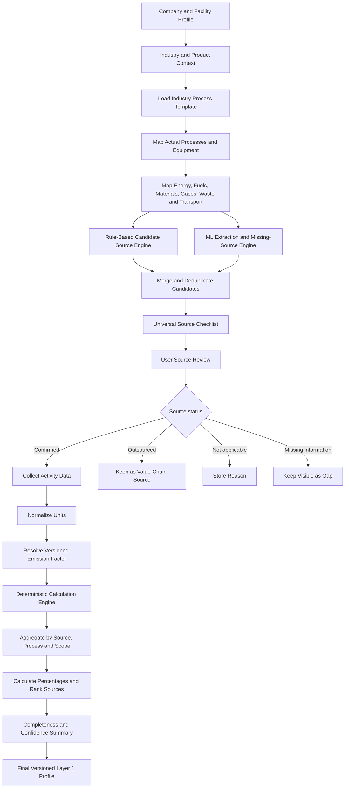
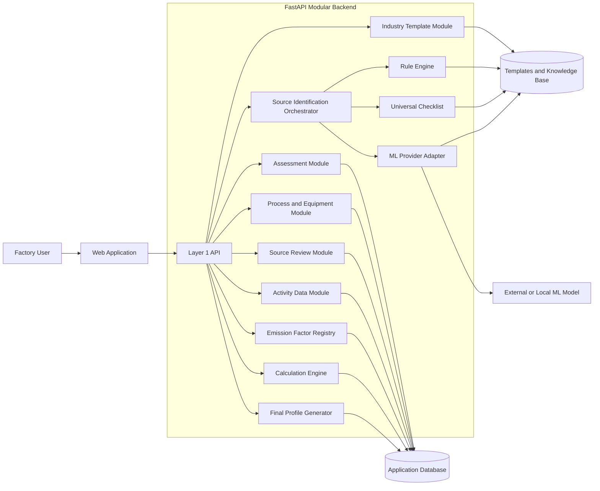
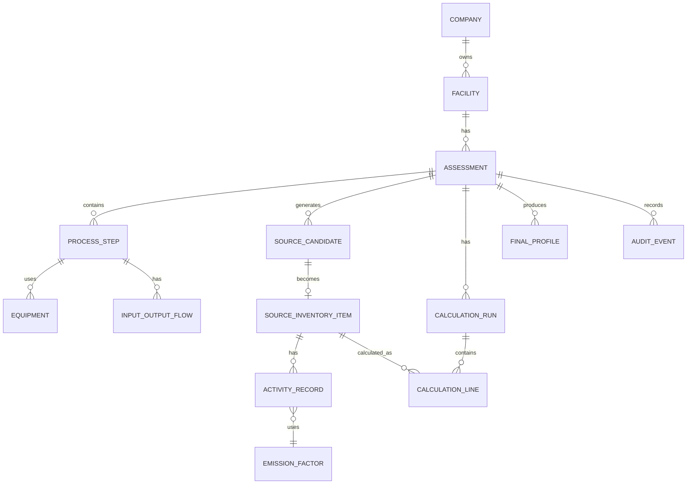
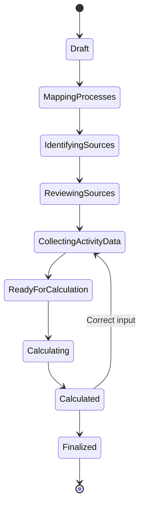

# Layer 1 Implementation Plan

## Industrial Emission Source Identification and Calculation Prototype

Status: Design approved for implementation planning. No application code has been created yet.

Working product name: EmissionLens. The name can be changed later without changing this design.

## 1. Purpose

Layer 1 converts a company profile into a trusted emissions profile.

It will:

1. Collect company, industry, product and facility details.
2. Understand the factory's real processes and equipment.
3. Identify possible emission sources using templates, rules and ML assistance.
4. Let the user confirm, reject or mark sources as outsourced.
5. Collect activity data for confirmed sources.
6. Select a compatible, versioned emission factor.
7. Calculate emissions with a deterministic calculation engine.
8. Calculate source percentages and rank the largest sources.
9. Produce a locked, versioned output profile for Layer 2.

Layer 2 will later use this trusted profile to generate circular interventions. Layer 2 is not part of this implementation.

## 2. Scope

### Included

- Company and facility onboarding
- Industry, sub-industry and product selection
- Industry process templates
- Custom process and equipment entry
- Energy, fuel, material, gas, transport, waste and wastewater mapping
- Rule-based source identification
- ML-assisted information extraction and missing-source suggestions
- Universal emission-source checklist
- Source review and confirmation
- Scope 1, Scope 2 and selected Scope 3 classification
- Activity-data collection
- Unit validation and conversion
- Versioned emission-factor registry
- Deterministic emissions calculations
- Emissions aggregation and source percentages
- Hotspot ranking
- Completeness and confidence reporting
- Versioned final output profile
- Audit history

### Not included

- Circular-intervention recommendations
- Intervention cost or payback calculations
- Carbon credits
- Regulatory certification
- Physical gas-leak sensors
- Full Scope 3 supply-chain accounting
- Automatic verification by external auditors
- ML-generated emission factors
- ML-generated carbon calculations

## 3. Main design rule

> ML helps find possible sources. Rules and the user confirm them. A deterministic engine calculates emissions.

The order is important:

```text
Identify source
    -> Confirm source
    -> Collect activity data
    -> Select emission factor
    -> Calculate emissions
    -> Rank sources
    -> Finalize trusted profile
```

The system cannot calculate a source before identifying it. It also cannot call a source a major hotspot until its emissions have been calculated.

## 4. End-to-end pipeline



## 5. System architecture

Use a modular monolith for the prototype. This is simpler to build and test than multiple backend microservices.



### Prototype technology choices

| Area | Choice | Reason |
|---|---|---|
| Frontend | Next.js with TypeScript | Good form handling, routing and dashboard support |
| Backend | FastAPI with Python | Good fit for rules, ML and calculation logic |
| Database | SQLite for local MVP; PostgreSQL-compatible design | Fast setup with a clear production migration path |
| Validation | Pydantic on backend and generated/shared schemas on frontend | Consistent data contracts |
| Knowledge base | Versioned JSON or YAML files | Easy to inspect, edit and test |
| ML integration | Provider adapter | Allows an API model or local model without changing domain logic |
| Charts | A React charting library | Source, scope and percentage visualizations |
| Testing | Pytest for backend; frontend unit tests; end-to-end browser test | Covers calculation and user flow |

## 6. Architecture components

| Component | Responsibility | Output |
|---|---|---|
| Web application | Collect inputs and display the workflow | Validated user requests |
| Assessment module | Store company, facility, boundary and reporting period | Assessment record |
| Industry template module | Load likely processes, equipment and questions | Editable starting template |
| Process mapper | Store the factory's actual process flow | Process and equipment graph |
| Rule engine | Convert explicit facts into source candidates | Explained source candidates |
| ML adapter | Extract facts and suggest missing sources | Potential candidates and questions |
| Universal checklist | Check all main emission-source families | Completeness status |
| Source review module | Record confirmed, outsourced, missing and not-applicable statuses | Reviewed source inventory |
| Activity module | Collect quantities and original units | Activity-data records |
| Factor registry | Select compatible versioned factors | Factor references |
| Calculation engine | Calculate line-item emissions | Reproducible calculation results |
| Aggregation engine | Total by source, process, category and scope | Totals and percentages |
| Profile generator | Freeze the trusted Layer 1 result | Versioned final profile |
| Audit module | Record changes and decisions | Audit history |

## 7. Layer details

### 7.1 Company and facility layer

Required fields:

- Company name
- Company type: micro, small, medium or other
- Facility name and location
- Industry and sub-industry
- Products manufactured
- Reporting period
- Production quantity and unit
- Operating shifts
- Facility ownership
- Selected organizational boundary
- Owned, leased and outsourced activities

Output:

- One assessment with a stable ID
- A clear facility and reporting boundary

### 7.2 Industry template layer

The industry template is a starting point. It never proves that a source exists.

Each template contains:

- Common products
- Likely process steps
- Likely equipment
- Common fuels and energy sources
- Common materials and chemicals
- Common gases and refrigerants
- Common waste and wastewater streams
- Common outsourced activities
- Verification questions

MVP templates:

1. Food processing: complete template
2. Textile: secondary demonstration template
3. Other industry: universal fallback questionnaire

### 7.3 Process and equipment layer

The user confirms the real process flow, for example:

```text
Raw material receipt
    -> Storage
    -> Preparation
    -> Manufacturing
    -> Cooling or finishing
    -> Packaging
    -> Waste treatment
    -> Dispatch
```

For each process, collect:

- Process name
- Description
- Onsite or outsourced
- Equipment
- Energy and fuel inputs
- Material and chemical inputs
- Gases and refrigerants
- Product and by-product outputs
- Waste and wastewater outputs
- Transportation activity
- Ownership or operational control

### 7.4 Rule engine

Rules provide deterministic and explainable source identification.

Example rules:

```text
IF equipment_type = boiler AND fuel_type is present
THEN suggest stationary combustion.

IF equipment_type = refrigeration
THEN suggest refrigerant leakage as a potential source.

IF purchased_electricity = true
THEN suggest purchased-energy emissions.

IF transport_owner = company
THEN suggest mobile combustion.

IF transport_owner = third_party
THEN suggest value-chain transportation.

IF waste_destination is external
THEN suggest waste generated in operations.
```

Every rule must store:

- Rule ID
- Trigger fields
- Suggested source type
- Reason shown to the user
- Follow-up question
- Rule version
- Active/inactive status

### 7.5 ML engine

The ML engine performs only these tasks:

1. Extract processes, equipment, fuels, materials, gases, waste and transport from free text.
2. Normalize different names for the same item.
3. Match the profile with similar records in the knowledge base.
4. Suggest possible missing sources.
5. Rank follow-up questions.

Example:

```text
User text: "Products are stored in two cold rooms."

ML extraction:
- Equipment: cold room
- Normalized equipment type: refrigeration system

Suggested source:
- Refrigerant leakage
- Status: potential
- Reason: refrigeration equipment is present, but refrigerant data is missing
```

ML must not:

- Confirm a source by itself
- Invent company facts
- Invent activity data
- Create emission factors
- Calculate emissions
- Change a confirmed calculation

If ML is unavailable, the rule engine and universal checklist must still complete the main workflow.

### 7.6 Universal checklist

Every assessment must explicitly review:

- Stationary combustion
- Mobile combustion
- Purchased electricity, heat, steam or cooling
- Industrial process emissions
- Refrigerant and other fugitive releases
- Purchased materials
- Upstream and downstream transportation
- Waste and treatment routes
- Wastewater and treatment routes
- Outsourced manufacturing

Every family receives one status:

- Confirmed
- Potential
- Missing information
- Not applicable
- Outsourced

Missing information is never treated as zero.

### 7.7 Source review and confirmation

The user reviews merged candidates from templates, rules, ML and the checklist.

| Status | Meaning | Next behaviour |
|---|---|---|
| Confirmed | Source exists inside the selected boundary | Collect activity data |
| Potential | Source may exist | Keep visible until resolved |
| Missing information | Required answer is missing | Show the missing field |
| Not applicable | Source does not exist | Store reason and user |
| Outsourced | Activity occurs outside direct control | Keep as value-chain source |

For the prototype, explicit confirmation by the authorized factory user is accepted. Evidence metadata can be stored but external assurance is not required.

### 7.8 Activity-data layer

Examples:

| Source | Activity data | Unit examples |
|---|---|---|
| Purchased electricity | Electricity consumed | kWh |
| Boiler fuel | Fuel consumed | litre, kg, standard cubic metre |
| Vehicle fuel | Fuel consumed or distance | litre, km |
| Refrigerant | Gas added, removed or lost | kg |
| Purchased material | Material purchased | kg, tonne |
| Transportation | Mass and distance | tonne-km |
| Waste | Waste quantity and treatment route | kg, tonne |
| Wastewater | Volume and process data | cubic metre |

Validation rules:

- Quantity cannot be negative.
- Unit must be supported for that activity type.
- Original quantity and unit must be preserved.
- Normalized value must be stored separately.
- Unusually large values create a warning, not silent correction.
- Missing values block that line's calculation.

### 7.9 Emission-factor registry

Every factor record contains:

- Factor ID
- Source name
- Activity category
- Factor value
- Input unit
- Output unit
- Geography
- Reporting year
- Gas coverage: CO2 or CO2e
- Scope or boundary label
- Source organization and reference
- Version and effective date
- Confidence or quality label
- Notes and assumptions

Factor selection order:

1. Company- or supplier-specific reviewed factor
2. Indian government factor
3. Recognized industry-specific factor
4. IPCC or another authoritative default
5. Clearly labelled demonstration proxy

The engine must not invent a factor when no compatible factor exists.

### 7.10 Deterministic calculation engine

Line-item calculation:

```text
emissions_kg_co2e
= activity_quantity
  x unit_conversion_multiplier
  x emission_factor
```

Aggregation:

```text
total_emissions = sum(valid line-item emissions)
```

Contribution:

```text
source_percentage
= source_emissions / quantified_total_emissions x 100
```

Intensity:

```text
emissions_intensity
= quantified_total_emissions / production_quantity
```

Calculation rules:

- Use decimal arithmetic.
- Round only for display.
- Save the activity record and factor version used.
- Do not calculate a missing or incompatible line.
- Do not include unresolved lines in the total.
- Call the total "partial" when material sources remain unquantified.
- Recalculate by creating a new calculation run, not by changing old results.

### 7.11 Hotspot ranking

After calculation:

1. Sort quantified sources by emissions from highest to lowest.
2. Calculate contribution percentages.
3. Highlight the top three quantified sources.
4. Optionally flag a source above a configurable threshold such as 20%.
5. Show unquantified sources beside the ranking.
6. Warn that an unquantified source may change the ranking.

The final wording should be "top quantified emission sources," not "all major sources," unless completeness is high.

### 7.12 Final profile generator

The final profile contains:

- Assessment and facility details
- Boundary and reporting period
- Confirmed source inventory
- Outsourced sources
- Not-applicable sources
- Unresolved source gaps
- Activity data
- Factor references
- Line-item calculations
- Scope totals
- Source percentages
- Ranked hotspots
- Emissions intensity
- Completeness and confidence
- Assumptions and exclusions
- Calculation run ID
- Layer 1 profile version

Finalization rules:

- A finalized profile is immutable.
- Corrections create a new version.
- Layer 2 receives only the selected finalized version.
- Old versions remain available for audit history.

## 8. Main data model



### Core entities

| Entity | Important fields |
|---|---|
| Company | ID, name, MSME type |
| Facility | ID, location, ownership |
| Assessment | ID, reporting period, boundary, status |
| IndustryTemplate | ID, industry, version, processes |
| ProcessStep | ID, name, order, onsite/outsourced |
| Equipment | ID, type, capacity, age, process ID |
| InputOutputFlow | Type, item, quantity availability, process ID |
| SourceCandidate | Source type, origin, reason, ML/rule version |
| SourceInventoryItem | Status, scope, process, equipment, confirmation |
| ActivityRecord | Quantity, unit, normalized quantity, data quality |
| EmissionFactor | Value, units, geography, source, version |
| CalculationRun | ID, timestamp, status, method version |
| CalculationLine | Activity, factor, result, source item |
| FinalProfile | Version, totals, ranking, completeness, finalized time |
| AuditEvent | Actor, action, entity, before/after value, timestamp |

## 9. Assessment state machine



Suggested stored values:

```text
DRAFT
MAPPING_PROCESSES
IDENTIFYING_SOURCES
REVIEWING_SOURCES
COLLECTING_ACTIVITY_DATA
READY_FOR_CALCULATION
CALCULATING
CALCULATED
FINALIZED
```

## 10. API design

### Assessment and profile

| Method | Endpoint | Purpose |
|---|---|---|
| POST | `/api/assessments` | Create an assessment |
| GET | `/api/assessments/{id}` | Read assessment state |
| PATCH | `/api/assessments/{id}` | Update profile or boundary |
| POST | `/api/assessments/{id}/finalize` | Create immutable final profile |
| GET | `/api/assessments/{id}/profiles` | List finalized versions |

### Process mapping

| Method | Endpoint | Purpose |
|---|---|---|
| GET | `/api/industry-templates` | List available templates |
| POST | `/api/assessments/{id}/load-template` | Load an editable template |
| PUT | `/api/assessments/{id}/processes` | Save actual process flow |
| PUT | `/api/processes/{id}/equipment` | Save process equipment |
| PUT | `/api/processes/{id}/flows` | Save inputs and outputs |

### Identification

| Method | Endpoint | Purpose |
|---|---|---|
| POST | `/api/assessments/{id}/identify` | Run templates, rules and ML |
| GET | `/api/assessments/{id}/candidates` | List candidate sources |
| PATCH | `/api/sources/{id}/status` | Confirm, reject or classify source |
| GET | `/api/assessments/{id}/checklist` | Show completeness checklist |

### Activity and calculation

| Method | Endpoint | Purpose |
|---|---|---|
| PUT | `/api/sources/{id}/activities` | Save source activity data |
| GET | `/api/emission-factors` | Search compatible factors |
| POST | `/api/assessments/{id}/calculate` | Create calculation run |
| GET | `/api/calculations/{id}` | Read line items and totals |
| GET | `/api/assessments/{id}/hotspots` | Read ranked quantified sources |

### Reports

| Method | Endpoint | Purpose |
|---|---|---|
| GET | `/api/profiles/{id}` | Read trusted Layer 1 profile |
| GET | `/api/profiles/{id}/export` | Export JSON, text or printable report |

## 11. Frontend screens

| Screen | Main purpose |
|---|---|
| 1. Start assessment | Create a new assessment or load a demo |
| 2. Company and facility | Capture industry, product, location and boundary |
| 3. Process builder | Confirm and edit process flow |
| 4. Equipment and flows | Map equipment, inputs and outputs |
| 5. Source candidates | Show rule, ML and checklist suggestions |
| 6. Source review | Confirm, outsource, reject or flag missing sources |
| 7. Activity data | Collect quantities for confirmed sources |
| 8. Calculation review | Show input x factor for every line |
| 9. Emissions dashboard | Show total, scopes, percentages and ranking |
| 10. Final Layer 1 profile | Show completeness, gaps and export controls |

Required user-interface states:

- Loading
- Empty
- Validation error
- ML unavailable
- No compatible factor
- Missing activity data
- Partial inventory warning
- Calculation failure with retry
- Finalized/locked profile

## 12. Project structure

The following structure should be created when coding begins:

```text
industrial-emissions-platform/
├── implementation.md
├── README.md
├── .env.example
├── .gitignore
├── docker-compose.yml                 # optional local database setup
│
├── apps/
│   └── web/
│       ├── app/
│       │   ├── assessments/
│       │   │   ├── new/
│       │   │   └── [assessmentId]/
│       │   │       ├── profile/
│       │   │       ├── processes/
│       │   │       ├── equipment/
│       │   │       ├── sources/
│       │   │       ├── activities/
│       │   │       ├── calculation/
│       │   │       └── report/
│       │   └── page.tsx
│       ├── components/
│       │   ├── forms/
│       │   ├── process-map/
│       │   ├── source-review/
│       │   ├── calculation/
│       │   ├── charts/
│       │   └── common/
│       ├── lib/
│       │   ├── api-client.ts
│       │   ├── schemas.ts
│       │   └── formatters.ts
│       ├── tests/
│       └── package.json
│
├── services/
│   └── identification-api/
│       ├── app/
│       │   ├── main.py
│       │   ├── config.py
│       │   ├── api/
│       │   │   ├── assessments.py
│       │   │   ├── processes.py
│       │   │   ├── identification.py
│       │   │   ├── activities.py
│       │   │   ├── calculations.py
│       │   │   └── profiles.py
│       │   ├── domain/
│       │   │   ├── assessments/
│       │   │   ├── processes/
│       │   │   ├── sources/
│       │   │   ├── activities/
│       │   │   ├── factors/
│       │   │   ├── calculations/
│       │   │   └── profiles/
│       │   ├── identification/
│       │   │   ├── orchestrator.py
│       │   │   ├── rule_engine.py
│       │   │   ├── candidate_merger.py
│       │   │   ├── checklist.py
│       │   │   └── ml_adapter.py
│       │   ├── calculations/
│       │   │   ├── unit_converter.py
│       │   │   ├── factor_resolver.py
│       │   │   ├── engine.py
│       │   │   ├── aggregator.py
│       │   │   └── hotspot_ranker.py
│       │   ├── persistence/
│       │   │   ├── database.py
│       │   │   ├── models.py
│       │   │   └── repositories/
│       │   ├── schemas/
│       │   └── audit/
│       ├── migrations/
│       ├── tests/
│       │   ├── unit/
│       │   ├── integration/
│       │   └── fixtures/
│       └── pyproject.toml
│
├── packages/
│   └── contracts/
│       ├── assessment.schema.json
│       ├── source.schema.json
│       ├── calculation.schema.json
│       └── final-profile.schema.json
│
├── data/
│   ├── taxonomy/
│   │   ├── source-types.json
│   │   ├── scopes.json
│   │   └── units.json
│   ├── industry-templates/
│   │   ├── food-processing.json
│   │   ├── textile.json
│   │   └── universal.json
│   ├── rules/
│   │   └── source-identification-rules.json
│   ├── emission-factors/
│   │   └── demo-factors.json
│   └── seed/
│       ├── sample-company.json
│       └── sample-assessment.json
│
├── docs/
│   ├── methodology.md
│   ├── source-taxonomy.md
│   ├── factor-governance.md
│   ├── ml-safeguards.md
│   └── demo-script.md
│
├── scripts/
│   ├── seed-data.sh
│   ├── validate-knowledge-base.sh
│   └── run-demo.sh
│
└── tests/
    └── e2e/
        └── assessment-flow.spec.ts
```

## 13. Final profile contract for Layer 2

Layer 2 should receive only a finalized profile.

Example shape:

```json
{
  "profile_id": "PROFILE-2026-0001",
  "profile_version": 1,
  "assessment_id": "ASM-2026-0001",
  "status": "FINALIZED",
  "company": {
    "name": "Sunrise Foods and Cold Chain Pvt. Ltd.",
    "industry": "food_processing",
    "sub_industry": "dairy",
    "facility_location": "Ahmedabad, Gujarat, India"
  },
  "reporting_period": {
    "start": "2025-04-01",
    "end": "2026-03-31"
  },
  "inventory": {
    "boundary_status": "PARTIAL_SCOPE_3",
    "total_tco2e": 60.944,
    "scope_1_tco2e": 18.494,
    "scope_2_tco2e": 33.750,
    "selected_scope_3_tco2e": 8.700
  },
  "confirmed_sources": [
    {
      "source_id": "SRC-001",
      "process": "cold_storage",
      "equipment": "refrigeration_system",
      "source_type": "purchased_grid_electricity",
      "scope": "SCOPE_2",
      "activity_quantity": 50000,
      "activity_unit": "kWh",
      "emissions_tco2e": 33.750,
      "contribution_percent": 55.38,
      "source_status": "CONFIRMED",
      "calculation_status": "COMPLETE"
    }
  ],
  "unquantified_sources": [],
  "completeness": "PARTIAL",
  "calculation_run_id": "CALC-2026-0001",
  "methodology_version": "layer1-v1"
}
```

Layer 2 trusts these finalized values and does not repeat source or baseline verification.

## 14. Validation and error rules

| Situation | Required behaviour |
|---|---|
| Negative quantity | Reject input |
| Unsupported unit | Reject input and list supported units |
| No compatible factor | Block that calculation line |
| ML unavailable | Continue with rules and checklist |
| Duplicate candidate | Merge origins and keep all reasons |
| Missing source data | Keep source visible and unquantified |
| Total mismatch | Block finalization |
| Percentage total differs because of rounding | Show a rounding note |
| Profile already finalized | Create a new version for changes |
| Partial Scope 3 | Label the total as partial |

## 15. Testing plan

### Unit tests

- Rule triggers and non-triggers
- Candidate deduplication
- Source status transitions
- Unit conversion
- Factor matching
- Electricity calculation
- Fuel calculation
- Refrigerant calculation
- Material calculation
- Waste calculation
- Percentage calculation
- Ranking ties
- Missing-factor behaviour
- Partial-total labelling

### Integration tests

- Create assessment and load template
- Save process and equipment flow
- Run rules and ML adapter
- Review and confirm candidates
- Add activity data
- Resolve factors
- Run calculation
- Finalize profile
- Retrieve immutable version

### End-to-end test

```text
Create food-processing assessment
-> confirm process flow
-> identify sources
-> confirm selected sources
-> enter activity data
-> calculate emissions
-> view ranked hotspots
-> finalize and export Layer 1 profile
```

### Required calculation fixtures

Use the existing workspace examples as product references:

- `sample_industry_profile.txt`
- `identification_layer_possible_emission_sources.txt`
- `sample_final_emissions_report.txt`

Convert the final agreed values into machine-readable JSON fixtures when coding begins.

## 16. Security and data handling

- Collect only information needed for the assessment.
- Validate all server-side inputs.
- Keep secrets outside source control.
- Do not log uploaded evidence or sensitive raw company data.
- Store audit events for status and calculation changes.
- Escape user-provided text before displaying it.
- Limit file types and sizes if uploads are later enabled.
- Mark all seeded companies and values as synthetic.
- Do not claim certification or third-party assurance.

## 17. Implementation order

### Phase 1 — Foundation

1. Create repository structure.
2. Add shared schemas and enums.
3. Create database models and migrations.
4. Add food-processing, textile and universal templates.
5. Add source taxonomy and units.

Exit condition: A seeded assessment, template and source type can be stored and read.

### Phase 2 — Process and identification

Phase 2 starts from the Phase 1 assessment, template and knowledge-read APIs. Its goal is to turn that assessment into a persisted, user-reviewed source inventory. ML, activity quantification and emissions calculations remain out of scope.

1. Define and validate Phase 2 contracts for process steps, equipment, input/output flows, source candidates, checklist items and source-inventory items.
2. Build the company/facility and process-mapping screens on top of the Phase 1 assessment record.
3. Load the selected industry template into an assessment as editable process suggestions; never treat template entries as confirmed facts.
4. Implement process and equipment persistence:
   - Save ordered process steps.
   - Save equipment attached to a process.
   - Save energy, fuel, material, waste, wastewater and transport flows.
   - Validate that referenced processes and equipment belong to the assessment.
5. Implement the deterministic rule engine using `data/rules/source-identification-rules.json`:
   - Evaluate normalized process, equipment and flow facts.
   - Create explained `POTENTIAL` candidates only.
   - Store rule ID, rule version, reason, provisional scope and follow-up questions.
6. Implement the identification-run service and endpoint:
   - Create a versioned identification run.
   - Execute template and rule origins.
   - Continue successfully when ML is unavailable.
   - Store the run result and generated candidates.
7. Implement candidate merge and deduplication:
   - Use a deterministic key based on source type, process and equipment context.
   - Merge template, rule, checklist and user origins.
   - Preserve every triggering reason and rule version.
   - Make repeated identification runs idempotent for the same input snapshot.
8. Materialize the universal checklist for every assessment:
   - Ensure every universal source family appears.
   - Mark unobserved families as `MISSING_INFORMATION`, not zero.
   - Keep outsourced activities visible as value-chain candidates.
9. Implement source review and inventory promotion:
   - Allow `CONFIRMED`, `POTENTIAL`, `MISSING_INFORMATION`, `NOT_APPLICABLE` and `OUTSOURCED`.
   - Require a reason for `NOT_APPLICABLE`.
   - Record reviewer, timestamp and confirmation note.
   - Promote reviewed candidates into `source_inventory_items` without deleting their candidate history.
10. Add Phase 2 read endpoints and tests:
    - Read process, equipment and flow mappings.
    - Read candidates and checklist state.
    - Update source status.
    - Verify rule triggers, non-triggers, deduplication, ownership boundaries and ML-free fallback.

Exit condition: The seeded food-processing assessment can load and edit its template, persist processes/equipment/flows, run deterministic identification without ML, produce deduplicated explained candidates, show a complete universal checklist, and return a persisted reviewed source inventory.

### Phase 3 — ML assistance

1. Define the ML input/output schema.
2. Implement provider adapter.
3. Add structured entity extraction.
4. Add missing-source suggestions.
5. Add explanations and model version.
6. Test non-ML fallback.

Exit condition: ML adds useful candidates without changing confirmed data.

### Phase 4 — Activity and calculation

1. Build activity-data forms.
2. Implement unit conversion.
3. Implement factor registry and resolver.
4. Implement pure calculation functions.
5. Add aggregation and percentage calculation.
6. Add hotspot ranking.

Exit condition: The synthetic fixture totals reconcile exactly.

### Phase 5 — Final profile

1. Build emissions dashboard.
2. Add unquantified-source warnings.
3. Add completeness and confidence summary.
4. Implement finalization and immutable versions.
5. Export JSON and printable report.

Exit condition: Layer 2 can consume one finalized trusted profile.

### Phase 6 — Hardening

1. Run unit, integration and end-to-end tests.
2. Test zero, missing, large and wrong-unit values.
3. Test ML failure.
4. Verify audit history.
5. Rehearse the complete demo.

Exit condition: The primary flow succeeds repeatedly without manual database edits.

## 18. Definition of done

- [ ] A user can create an assessment with company, facility, industry and product details.
- [ ] An industry template loads but remains editable.
- [ ] The user can map real processes, equipment, inputs and outputs.
- [ ] Rules generate explained source candidates.
- [ ] ML extracts profile facts and suggests missing sources.
- [ ] The system works when ML is unavailable.
- [ ] Every universal source family receives a status.
- [ ] Confirmed sources accept validated activity data.
- [ ] Every calculated line uses a compatible, versioned factor.
- [ ] Scope and total values reconcile.
- [ ] Percentages and hotspot ranking are correct.
- [ ] Missing sources remain visible and are not treated as zero.
- [ ] Partial inventories are labelled clearly.
- [ ] A finalized profile is immutable and versioned.
- [ ] The final JSON profile is ready for Layer 2.
- [ ] No circular-intervention code exists inside Layer 1.

## 19. First coding milestone

The first implementation milestone should be a thin end-to-end path:

```text
Create food-processing company
-> load process template
-> confirm diesel boiler and purchased electricity
-> create two source records
-> enter activity values
-> apply two seeded factors
-> calculate emissions
-> display percentages
-> export one finalized Layer 1 JSON profile
```

Complete this path before adding more industries, document uploads, advanced ML, extra charts or complex Scope 3 categories.
