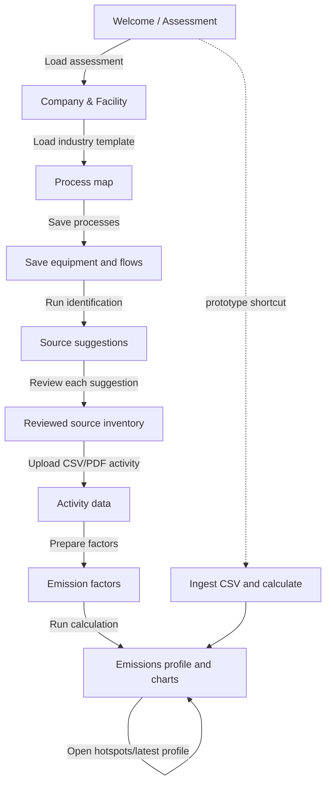

# EmissionLens UI flow and REST API map

This document defines the prototype navigation. Users interact with labelled buttons; the UI calls the REST APIs in the sequence below.

## Screen-to-API mapping

| Screen / button | REST call | Result used by next screen |
|---|---|---|
| Choose assessment | `GET /api/assessments/{assessment_id}` | Assessment, facility, industry and reporting period |
| Load industry starter map | `POST /api/assessments/{assessment_id}/load-template` | Editable process suggestions |
| View process map | `GET /api/assessments/{assessment_id}/processes` | Saved process steps and equipment |
| Save process map | `PUT /api/assessments/{assessment_id}/processes` | Persisted ordered processes |
| Save equipment | `PUT /api/processes/{process_id}/equipment` | Equipment attached to a process |
| Save inputs/outputs | `PUT /api/processes/{process_id}/flows` | Energy, fuel, materials, waste and transport facts |
| Find possible sources | `POST /api/assessments/{assessment_id}/identify` with `include_ml: true` | Versioned rule + ML identification run |
| Load suggestions | `GET /api/assessments/{assessment_id}/candidates` | Candidates awaiting user review |
| Review source | `POST /api/assessments/{assessment_id}/candidates/{candidate_id}/review` | Confirmed/outsourced/gap/not-applicable inventory item |
| Check source coverage | `GET /api/assessments/{assessment_id}/checklist` | Universal checklist and missing information |
| Load confirmed inventory | `GET /api/assessments/{assessment_id}/inventory` | Sources eligible for activity data |
| Upload activity file | `POST /api/assessments/{assessment_id}/import-activity-file?filename=...` | Parsed and unit-normalized activity records |
| View source activities | `GET /api/sources/{source_id}/activities` | Imported activity history |
| Prepare demo factors | `POST /api/emission-factors/seed-demo` | Active prototype emission factors |
| Resolve factor (optional) | `POST /api/emission-factors/resolve` | Compatible versioned factor |
| Run calculation | `POST /api/assessments/{assessment_id}/calculate` | New immutable calculation run |
| View final profile | `GET /api/assessments/{assessment_id}/latest-profile` | Totals, scopes, sources, categories, processes and warnings |
| View hotspots | `GET /api/assessments/{assessment_id}/hotspots` | Ranked quantified sources and gaps |
| View run details | `GET /api/calculations/{calculation_id}` | Line-level calculation evidence |

## Prototype shortcut

For a demo where the user only uploads a raw CSV, the UI can call:

`POST /api/assessments/{assessment_id}/ingest-and-calculate-csv`

The response is shown directly on the final profile page. This shortcut still applies the same source matching, unit normalization, factor compatibility and deterministic calculation rules. It must label results as prototype/demo data when demo factors are used.

## Required navigation rules

- Do not show raw endpoint URLs to users; expose the labels in the table as buttons.
- Disable activity upload until at least one source is `CONFIRMED` (or use the CSV shortcut).
- Disable calculation until activity records and compatible factors exist.
- Keep unmatched CSV rows and unresolved factors visible as gaps.
- Never auto-confirm template or ML suggestions without an explicit demo-mode action.
